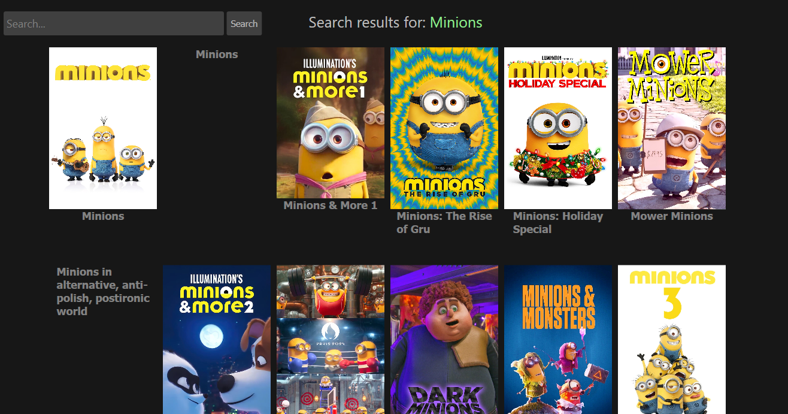
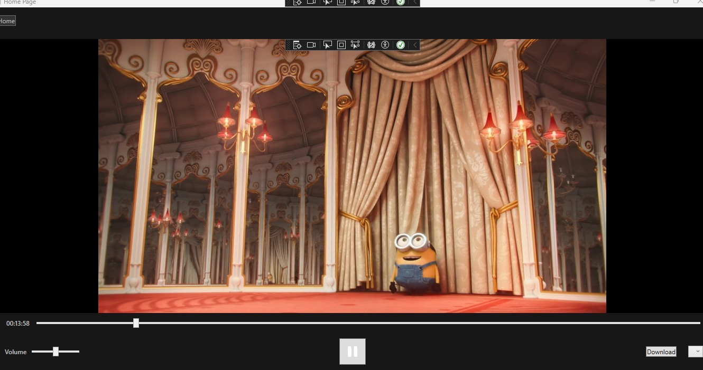

# MultiMovies Project

## What is it? 

MultiMovies is a pirated movies streaming service with full subtitle support that let's you watch any movie for free at high quality

It relies upon the [Rust Proxy](https://github.com/MMinusOne/rust-proxy) and [Embed Movie](https://github.com/MMinusOne/embed-movie) and [Lib VLC Sharp](https://github.com/videolan/libvlcsharp) APIs.

## Front page

It also shows popular movies cards below the most popular movie poster.

## Search page 

## Watch page 

You can watch, pause, adjust volume, and set subtitles from English, Russian, Spanish and more on some movies at super high quality that is adjusted based on the network's speed.
